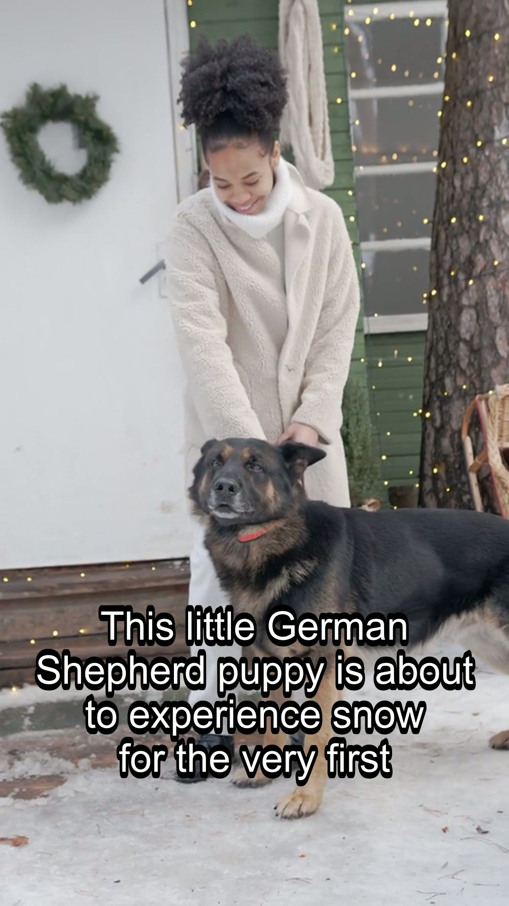

# ittybitty

**Topic or script in → narrated video out.** Shorts for TikTok and Reels, or longer chaptered explainers — with stock footage, your Jellyfin/Plex home videos, or local AI clips.

[](LICENSE)
[](docs/ALPHA-RELEASE-CHECKLIST.md) · [中文 README](README-zh.md)

> **Alpha — under construction.** APIs, pipelines (R3 screening, R9 talker), and the Windows installer may change between releases. Not production-ready. See [alpha release checklist](docs/ALPHA-RELEASE-CHECKLIST.md) before going public or tagging.

**Three ways to use it** (pick one):

| | **Windows app** | **Web dashboard** | **MCP server** |
|---|---|---|---|
| **For** | Everyday use on your PC | Browser UI while you develop or self-host | Cursor, Claude, other MCP clients |
| **You get** | Installer + desktop shortcut; backend starts automatically | Generate, Jobs, Depot, Settings, Help | `videogen_*` tools for agents |
| **Start** | [Download installer](#windows-app) | [Run locally](#web-dashboard) or use the app above | [Connect MCP](#mcp-server) |

Same engine under all three: Python backend on port **11054**, React dashboard on **11055** when running the dev stack.

---

## Contents

| | |
|---|---|
| [Windows app](#windows-app) | Installer — no Python required |
| [Web dashboard](#web-dashboard) | Browser UI (dev or bundled in desktop app) |
| [MCP server](#mcp-server) | Agent automation |
| [What you need](#what-you-need) | Keys and optional extras |
| [Footage sources](#footage-sources) | Where B-roll comes from |
| [vs MoneyPrinterTurbo](#how-this-differs-from-moneyprinterturbo) | Why pick ittybitty |
| [More help](#more-help) | Config, troubleshooting, API docs |
| [Marketing site](https://sandraschi.github.io/ittybittyvideos/) | GitHub Pages one-pager (also [website/](website/index.html) locally) |

---

## Windows app

Best if you just want to make videos.

1. Download the latest **pre-release** installer from [Releases](https://github.com/sandraschi/ittybittyvideos/releases) (tag `v0.2.0-alpha.*` or newer)
2. Run the installer → launch **ittybitty** from Start or your desktop shortcut
3. In **Settings**, add a free stock API key ([Pexels](https://www.pexels.com/api/), [Pixabay](https://pixabay.com/api/docs/), or [Coverr](https://coverr.co/developers)) → **Generate** with a topic or paste a script

The installer bundles the **web dashboard** and **Python backend** — no separate Python or Node install.

Install folder: `%LOCALAPPDATA%\ittybitty\`  
If the backend fails to start: `%LOCALAPPDATA%\ai.fleet.ittybitty\logs\backend-spawn.log`

---

## Web dashboard

The React UI: Generate, Plan (mid-length), Jobs, Depot, Publish, Settings, Help, Logs.

**Already using the Windows app?** You're in the dashboard — nothing else to install.

**Running on your dev machine** (live reload, for contributors):

```powershell
git clone https://github.com/sandraschi/ittybittyvideos.git videogen-mcp
cd videogen-mcp
.\start.bat
```

Open **http://127.0.0.1:11055**. The script starts the dashboard and the API together.

Needs **Python 3.10+**, **FFmpeg**, and **Node.js** — see [INSTALL.md](INSTALL.md).

---

## MCP server

For AI agents that should generate or plan videos over the Model Context Protocol.

1. Start the backend (Windows app running, or `.\start.bat -BackendOnly`, or `uv run python -m videogen_mcp.server`)
2. Point your MCP client at **`http://127.0.0.1:11054/mcp`**

Example prompts: *"Generate a 45-second video about Vienna coffee culture"* · *"Plan a 5-minute sourdough tutorial"* · *"Call videogen_help first"*

Tool list and REST API: [docs/TOOLS.md](docs/TOOLS.md) (16 MCP tools; catalog at `/api/v1/tools`) · Claude Desktop / MCPB: [INSTALL.md](INSTALL.md)

---

## What you need

| For | You need |
|-----|----------|
| **Most workflows** | [FFmpeg](https://ffmpeg.org/) on PATH + free stock API key (**Pexels**, **Pixabay**, or **Coverr**) |
| **Topic → script** | DeepSeek or OpenAI key, or paste your own script |
| **Home videos as B-roll** | Jellyfin or Plex URL + token ([Settings](docs/CONFIGURATION.md)) |
| **Local AI clips (GPU)** | CUDA ~24 GB + `.\start-localgen.bat` |

The in-app **Help** page walks through each step.

---

## Footage sources

Pick one in **Settings → Footage** (free tier = no GPU):

- **Pexels** — free stock (default)
- **Pixabay** — free stock (MPT parity)
- **Mixkit** — free 1080p clips, no API key
- **NASA** — public-domain space/science footage, no API key
- **Jellyfin / Plex** — cut clips from your library (vacation, pets, …)
- **Veo / Omni** — Google cloud ([config](docs/CONFIGURATION.md))
- **LocalGen** — Wan 2.2 on your GPU

Finished videos land in `./output/` and appear in **Depot**.

---

## How this differs from MoneyPrinterTurbo

[MoneyPrinterTurbo](https://github.com/Harry-Yu-001/MoneyPrinterTurbo) popularized *topic → short video*. ittybitty targets the same job with **fleet tooling**: agents, longer formats, your own libraries, and a path to local GPU — still **alpha**, so expect rough edges.

| | MoneyPrinterTurbo | ittybitty (alpha) |
|--|-------------------|-------------------|
| **How you run it** | Web UI | **Windows app** + web dashboard + **HTTP MCP** |
| **Length** | Mostly shorts (~60s) | Shorts + **3–15 min** chapters (planner + videographer rules) |
| **Footage** | Pexels, Pixabay, Coverr (+ local/social) | Same three **+ Mixkit + NASA (no key) + Jellyfin/Plex + LocalGen + Veo/Omni** |
| **Agents** | — | **`videogen_*` tools** for Cursor, Claude, fleet MCP clients |
| **Library & jobs** | — | **SQLite depot**, job history, publish handoff |
| **Edit intelligence** | Assembly / concat | **Hook, pacing, B-roll, transitions**; R1 karaoke subs; R2 beat snap + ducking; R3 screening (experimental) |
| **Architecture** | Monolith | **Plugin registry** — swap LLM, stock, and TTS providers |
| **Desktop** | — | **NSIS installer** (Windows, backend bundled) |
| **Status** | Mature OSS | **Alpha** — [checklist](docs/ALPHA-RELEASE-CHECKLIST.md) |

中文说明与中国本地栈（通义千问、CosyVoice 等）：[README-zh.md](README-zh.md)

---

## Sample output



*"German Shepherd puppy discovers snow for the first time"* -- generated in ~55 seconds.
[Download full MP4 (17 MB)](https://github.com/sandraschi/ittybittyvideos/releases/download/v0.2.0/gsd-puppy-snow-demo.mp4)

Quick test render:

```powershell
py scripts/smoke_render.py
```

[docs/examples/README.md](docs/examples/README.md)

---

## More help

| Doc | When to read it |
|-----|-----------------|
| [INSTALL.md](INSTALL.md) | All install paths, MCPB, verification |
| [docs/CONFIGURATION.md](docs/CONFIGURATION.md) | Env vars and providers |
| [docs/TROUBLESHOOTING.md](docs/TROUBLESHOOTING.md) | Something broke |
| [docs/ALPHA-RELEASE-CHECKLIST.md](docs/ALPHA-RELEASE-CHECKLIST.md) | Going public / alpha tag |
| [docs/PROMPT-DIRECTOR.md](docs/PROMPT-DIRECTOR.md) | R10 trope templates (mermaid) |
| [docs/EXEMPLARS-RESEARCH.md](docs/EXEMPLARS-RESEARCH.md) | Viral Short formats + mid expansion |
| [docs/TOOLS.md](docs/TOOLS.md) | MCP tools and REST API |
| [docs/DEVELOPMENT.md](docs/DEVELOPMENT.md) | Tests, Tauri build, CI |
| [SPEC.md](SPEC.md) | Architecture and roadmap |
| [CHANGELOG.md](CHANGELOG.md) | Version history |

**Fleet docs:** [mcp-central-docs/projects/ittybitty](https://github.com/sandraschi/mcp-central-docs/tree/main/projects/ittybitty)

---

MIT · [sandraschi](https://github.com/sandraschi) · v0.2.0

*Repo folder `videogen-mcp`, Python package `videogen_mcp` — kept for MCP tool compatibility.*
