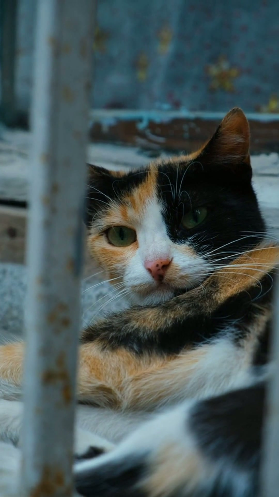

# roughcutvideos

**Topic or script in → short or mid-length video out.** Fleet-grade AI video generation with a React dashboard, SQLite depot, and optional local Wan 2.2 footage on your GPU.

[](LICENSE)
[](https://github.com/jlowin/fastmcp)
[](https://www.python.org/)

**Repo folder:** `videogen-mcp` · **Python package:** `videogen_mcp` · **Product name:** roughcutvideos

---

## Features

- **Short pipeline** — 30–60 s vertical or landscape clips from a topic or custom script
- **Mid-length pipeline** — 3–15 min chaptered videos with storyboard planning and videographer rules
- **Stock footage** — Pexels (default), Google **Veo** / **Gemini Omni** (cloud), or LocalGen Wan 2.2 (local GPU)
- **TTS & subtitles** — Edge TTS (default), CosyVoice optional; burned-in or sidecar SRT
- **Depot** — SQLite-backed library of every render under `./output/` with posters and metadata
- **Publish helpers** — Platform upload URLs and `#roughcutvideos` copy for YouTube, TikTok, Instagram
- **MCP + REST** — FastMCP tools at `/mcp` and OpenAPI at `/docs` on port **11054**

---

## Example output

Real render from this repo (smoke test, 2026-06-12) — not a mockup.



<video src="docs/examples/cats-facts-short.mp4" controls width="280">
  <a href="docs/examples/cats-facts-short.mp4">Download cats-facts-short.mp4</a>
</video>

| | |
|---|---|
| **Duration** | ~22 s |
| **Format** | 1080×1920 vertical (9:16) |
| **Footage** | Pexels — 6 B-roll clips |
| **Narration** | Edge TTS |
| **Script** | Custom text (no LLM) — same copy as the Generate page sample |

> *"Cats are fascinating companions. They sleep up to sixteen hours a day and still find time to judge you…"*

[Download MP4](docs/examples/cats-facts-short.mp4) · [Reproduce this demo](docs/examples/README.md) (`py scripts/smoke_render.py`)

---

## Quick start

### Desktop (recommended)

```powershell
cd D:\Dev\repos\videogen-mcp
.\start.bat
```

Open **http://127.0.0.1:11054** → **Generate** → enter a topic → wait for the job → **Depot** to download.

### Local AI footage (optional)

On a machine with ~24 GB VRAM and CUDA:

```powershell
.\start-localgen.bat
```

In **Settings**, set stock provider to **localgen** (or use Pexels for zero-GPU workflow).

---

## Installation

See **[INSTALL.md](INSTALL.md)** for MCPB drag-and-drop, manual Claude config, developer setup, and verification.

| Path | Use when |
|------|----------|
| [INSTALL.md](INSTALL.md) | First-time install |
| [docs/CONFIGURATION.md](docs/CONFIGURATION.md) | API keys, providers, `.env` |
| [docs/TROUBLESHOOTING.md](docs/TROUBLESHOOTING.md) | Common failures |

---

## Configuration (summary)

| Variable | Required | Default | Description |
|----------|----------|---------|-------------|
| `PEXELS_API_KEY` | For Pexels stock | — | Free key from [pexels.com/api](https://www.pexels.com/api/) |
| `DEEPSEEK_API_KEY` | For DeepSeek script mode | — | Cloud LLM for topic → script |
| `OPENAI_API_KEY` | For OpenAI script mode | — | Alternative cloud LLM |
| `VIDEOGEN_PORT` | No | `11054` | Backend + built webapp |
| `VIDEOGEN_OUTPUT_DIR` | No | `./output` | Renders + `depot.db` |
| `LOCALGEN_URL` | No | `http://127.0.0.1:8188` | LocalGen sidecar |

Most settings can be edited in the webapp **Settings** page (writes `.env`). Full list: [docs/CONFIGURATION.md](docs/CONFIGURATION.md).

---

## Documentation

| Document | Description |
|----------|-------------|
| [INSTALL.md](INSTALL.md) | Install options (MCPB, source, dev) |
| [docs/CONFIGURATION.md](docs/CONFIGURATION.md) | Environment variables and providers |
| [docs/DEVELOPMENT.md](docs/DEVELOPMENT.md) | Dev server, tests, packaging |
| [docs/TOOLS.md](docs/TOOLS.md) | MCP tools and REST API |
| [docs/TROUBLESHOOTING.md](docs/TROUBLESHOOTING.md) | Fixes for common issues |
| [SPEC.md](SPEC.md) | Architecture and roadmap |
| [AGENTS.md](AGENTS.md) | Notes for coding agents |
| In-app **Help** | Tabbed guide at `/help` in the dashboard |

Fleet registry: [mcp-central-docs/projects/roughcutvideos](https://github.com/sandraschi/mcp-central-docs/tree/main/projects/roughcutvideos)

---

## MCP usage

Server runs as HTTP (not stdio). Point an MCP client at `http://127.0.0.1:11054/mcp` after `start.bat`, or see [INSTALL.md](INSTALL.md) for Claude Desktop patterns.

Example prompts:

- *"Generate a 45-second video about Vienna coffee culture using Pexels footage."*
- *"Plan a 5-minute mid-length video on sourdough baking — show the storyboard first."*
- *"What videogen providers are available?"*

Tool reference: [docs/TOOLS.md](docs/TOOLS.md).

---

## Development

```powershell
pip install -e ".[dev]"
py -m pytest
```

Webapp dev (hot reload on **11055**, API proxy to **11054**):

```powershell
cd webapp
npm install
npm run dev
```

Details: [docs/DEVELOPMENT.md](docs/DEVELOPMENT.md).

---

## License

MIT — see [LICENSE](LICENSE).

**Status:** MVP (core pipelines + depot + LocalGen sidecar)  
**Maintained by:** sandraschi  
**Last updated:** 2026-06-12
