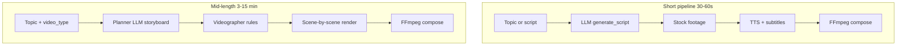
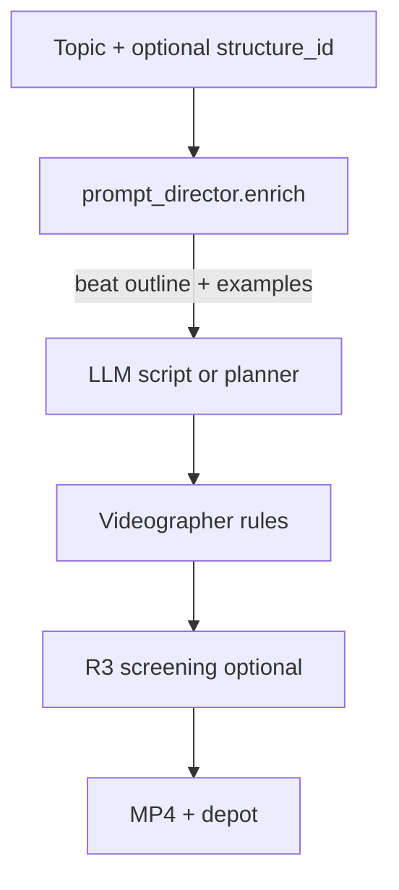
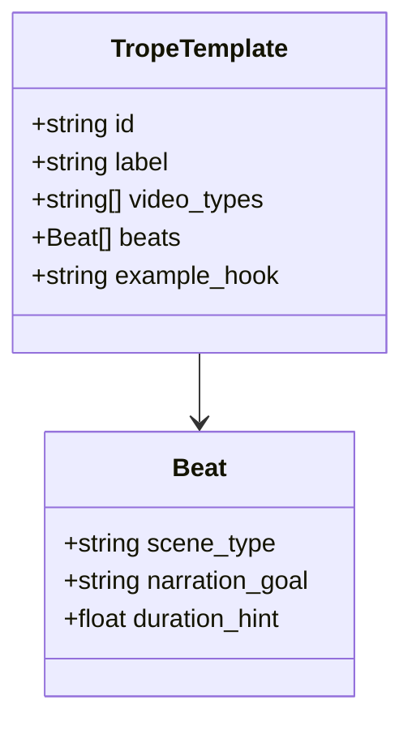
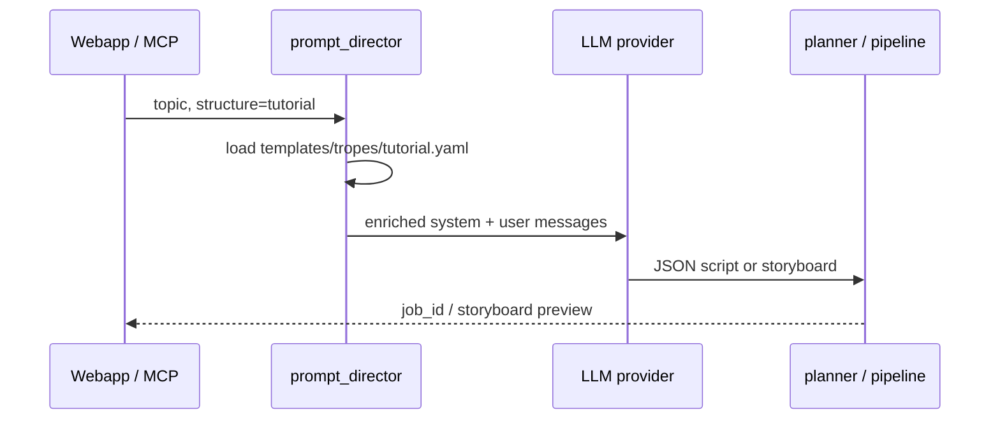

# Prompt director (R10)

Optional narrative structure layer **before** LLM script/storyboard calls. Planned for v0.4+ — see [SPEC.md § R10](../SPEC.md).

**Today:** thin system prompts in `providers/llm_openai.py` (shorts) and `services/planner.py` (mid-length). **R10** injects trope/genre beat outlines from a curated offline corpus — not live [TV Tropes](https://tvtropes.org/) scraping.

**Webapp today:** [Prompt library](/prompts) samples + **Director (optional)** on Generate/Plan — **8 curated recipes** by default; full trope/intro YAML lists behind “Show all packs”. Plain topic-only is the default path.

---

## Pipeline (current)

---

## Pipeline (with R10 prompt director)

---

## Trope template shape (planned)

Files live under `templates/tropes/*.yaml`. Example ids: `tutorial`, `documentary`, `listicle`, `hype-short`, `explainer-problem-solution`.

---

## Data flow (API)

---

## Relation to other roadmap items

| Item | Layer |
|------|--------|
| **R10** Prompt director | *What to say* — narrative beats |
| **R7** Templates | *How it looks* — fonts, LUT, transitions |
| **R3** Screening | *QC* — VLM critique after render |
| Videographer rules | *Timing* — hook, pacing, B-roll slots |

---

## Implementation checklist

See [TODO.md](../TODO.md) § R10 Prompt director.

When implementing:

1. `services/prompt_director.py` — `load_trope(id)`, `enrich(messages, structure_id, style_notes)`
2. Optional `structure` on generate/plan REST bodies and MCP tools
3. `videogen_structures` — list trope ids + labels
4. Wire webapp Prompt library → pass `structure` when backend supports it

---

## Legal / corpus

- Do **not** scrape tvtropes.org in the default path (ToS, HTML noise, rate limits).
- Maintain **your own** short beat outlines inspired by common formulas (tutorial, cold open, listicle, etc.).
- Contributors add YAML under `templates/tropes/` — good first PR surface (pairs with R7 visual templates).
